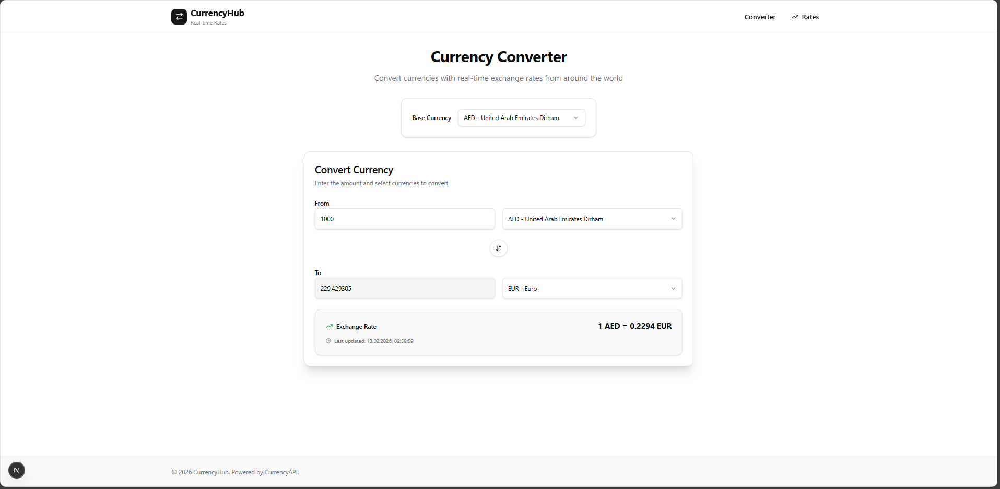
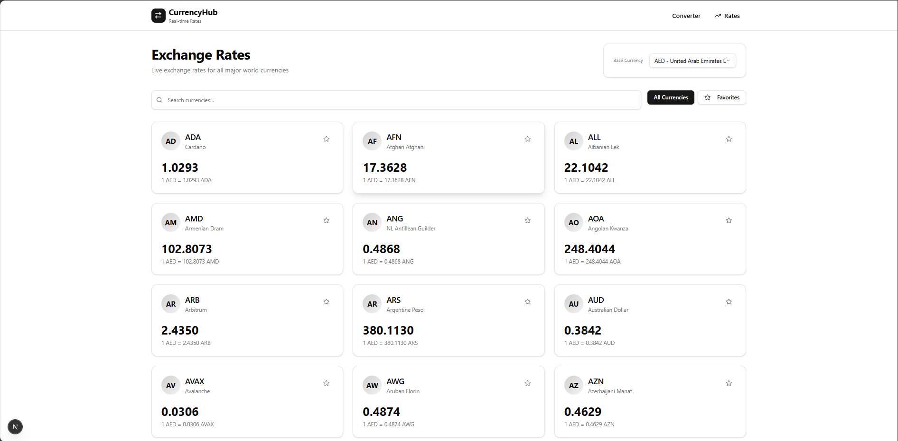

# CurrencyHub

Фронтенд-приложение для помощи в конвертации валют.

## Цель:

Написать SPA для конвертирования валют. Для получения текущих курсов использовать любое открытое
API

## Что делает приложение:

### Получает список доступных для конвертации валют

### Получает курсы относительно заданной валюты

### Позволяет сконвертировать две валюты по актуальному курсу

Данные хранятся в localStorage для повторного использования или перезаходе на страницу

## Технологии:

- Typescript
- Next js

## Требования

- Node.js 16+ (LTS)
- API ключ от [CurrencyAPI](https://currencyapi.com/)

## Использование

### Запуск приложения

1. `git clone <repository-url>`
2. `cd nextjs-converter-currencies`
3. `npm install`
4. `npm run dev`
